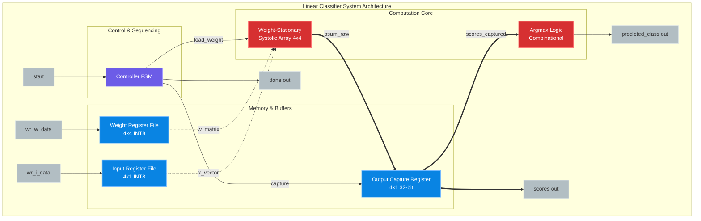
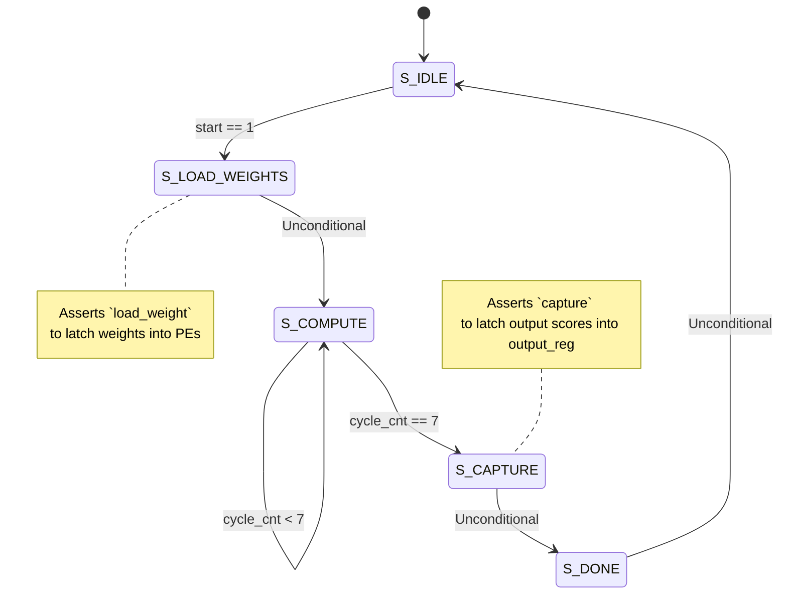

# tinyInferenceChip: Custom AI Accelerator for Edge Inference

`tinyInferenceChip` is a parameterized, hardware-efficient **4×4 Weight-Stationary Systolic Array AI Accelerator** designed for edge intelligence. The core is designed to compute linear classification tasks ($y = x \cdot W$) directly in hardware, automatically determining the predicted class using combinational argmax logic. It is optimized to be tightly coupled with a host processor, such as a **RISC-V core**, via memory-mapped register files or custom coprocessor interfaces (e.g., RISC-V RoCC).

---

## 🚀 Key Features

*   **Weight-Stationary Systolic Array:** A 4×4 grid of Processing Elements (PEs) optimized to maximize data reuse, minimize global memory access, and bypass the traditional Von Neumann memory wall.
*   **Edge AI Quantization Support:** Designed with 8-bit signed integer (INT8) input/weight data widths (`DW=8`) and a 32-bit signed accumulator (`AW=32`) to prevent overflow during matrix multiplications.
*   **Autonomous Argmax Classification:** Integrated combinational logic automatically determines the class with the highest score, returning a 2-bit classification index.
*   **Fully-Pipelined Controller FSM:** Coordinates the entire workflow (loading weights, streaming inputs, compute cycles, output capture, and done notification) with strict cycle counts.
*   **Self-Checking Verification Suite:** Includes a robust SystemVerilog testbench containing 5 distinct validation scenarios, confirming signed operations, zero-vector stability, and identity passthrough logic.

---

## 📁 Repository Structure

```text
tinyInferenceChip/
├── compute/
│   ├── linear_classifier.sv     # Top-level integration core
│   ├── linear_classifier_tb.sv  # Main self-checking testbench (5 test cases)
│   ├── pe.sv                    # Weight-Stationary Processing Element (MAC unit)
│   └── systolic_4x4.sv          # 4x4 2D systolic array core
├── control/
│   └── controller_fsm.v         # Control Finite State Machine
├── registers/
│   ├── input_reg.sv             # 4-element INT8 input activation register
│   ├── weight_reg.sv            # 4x4 INT8 weight matrix register
│   └── output_reg.sv            # 4-element 32-bit output capture register
├── verification/                # Additional unit verification tests
│   ├── tb_input_reg.sv
│   └── tb_weight_reg.sv
├── README.md                    # Project documentation (this file)
└── transcript                   # Simulation transcript/log from QuestaSim
```

---

## 📐 System Architecture

### Internal Block Diagram

The accelerator coordinates memory buffers, a control state machine, the systolic computing mesh, and an output evaluation unit:



### Systolic Array Dataflow (4x4)

Weights ($W$) are loaded directly inside each Processing Element (PE) and kept stationary. Input activations ($x$) flow from left to right, while partial sums ($psum$) flow from top to bottom:

```mermaid
graph TD
    %% Inputs
    in0((x[0])) --> PE00
    in1((x[1])) --> PE10
    in2((x[2])) --> PE20
    in3((x[3])) --> PE30

    %% Row 0
    PE00[PE 0,0] -->|act| PE01[PE 0,1]
    PE01 -->|act| PE02[PE 0,2]
    PE02 -->|act| PE03[PE 0,3]

    %% Row 1
    PE10[PE 1,0] -->|act| PE11[PE 1,1]
    PE11 -->|act| PE12[PE 1,2]
    PE12 -->|act| PE13[PE 1,3]

    %% Row 2
    PE20[PE 2,0] -->|act| PE21[PE 2,1]
    PE21 -->|act| PE22[PE 2,2]
    PE22 -->|act| PE23[PE 2,3]

    %% Row 3
    PE30[PE 3,0] -->|act| PE31[PE 3,1]
    PE31 -->|act| PE32[PE 3,2]
    PE32 -->|act| PE33[PE 3,3]

    %% Psum flows down
    0_0((0)) --> PE00; 0_1((0)) --> PE01; 0_2((0)) --> PE02; 0_3((0)) --> PE03
    PE00 -->|psum| PE10; PE01 -->|psum| PE11; PE02 -->|psum| PE12; PE03 -->|psum| PE13
    PE10 -->|psum| PE20; PE11 -->|psum| PE21; PE12 -->|psum| PE22; PE13 -->|psum| PE23
    PE20 -->|psum| PE30; PE21 -->|psum| PE31; PE22 -->|psum| PE32; PE23 -->|psum| PE33

    %% Outputs
    PE30 ==> psum_out0[[y[0]]]
    PE31 ==> psum_out1[[y[1]]]
    PE32 ==> psum_out2[[y[2]]]
    PE33 ==> psum_out3[[y[3]]]
    
    classDef pe fill:#6c5ce7,stroke:#a29bfe,stroke-width:2px,color:white;
    class PE00,PE01,PE02,PE03,PE10,PE11,PE12,PE13,PE20,PE21,PE22,PE23,PE30,PE31,PE32,PE33 pe;
```

---

## 🎛️ Register and Interface Specification

### Parameters
*   `DW` (Default: `8`): Word width of input activations and weights.
*   `AW` (Default: `32`): Word width of partial sums and output scores.
*   `N`  (Default: `4`): Structural dimension parameter for matrix $N \times N$.

### Core I/O Ports

| Port Name | Direction | Width | Description |
| :--- | :--- | :--- | :--- |
| `clk` | Input | 1 bit | Core clock. |
| `rst_n` | Input | 1 bit | Active-low asynchronous reset. |
| `wr_weight` | Input | 1 bit | Weight register file write enable. |
| `wr_w_row` | Input | 2 bits | Row address select for weight upload ($0-3$). |
| `wr_w_col` | Input | 2 bits | Column address select for weight upload ($0-3$). |
| `wr_w_data` | Input | `DW` bits | Weight value to write at `(row, col)`. |
| `wr_input` | Input | 1 bit | Input activation register file write enable. |
| `wr_i_addr` | Input | 2 bits | Address select for input features ($0-3$). |
| `wr_i_data` | Input | `DW` bits | Feature value to write at `addr`. |
| `start` | Input | 1 bit | Pulse to initiate matrix-vector multiplication. |
| `scores` | Output | $N \times AW$ bits | Latched classification outputs ($y[0], y[1], y[2], y[3]$). |
| `predicted_class` | Output | 2 bits | Class index ($0-3$) corresponding to the maximum score value. |
| `done` | Output | 1 bit | Status flag indicating evaluation cycle complete. |

---

## ⏱️ Finite State Machine (FSM)

The control logic manages the hardware sequencing through five cycles:



1.  **`S_IDLE`**: Awaiting a `start` pulse from the host processor.
2.  **`S_LOAD_WEIGHTS`**: A 1-cycle state that broadcasts the weight-matrix buffer entries into the local PE registers.
3.  **`S_COMPUTE`**: Runs for $2N-1$ clock cycles ($7$ cycles for $N=4$) to allow the features to propagate across all columns and the final results to settle at the bottom row.
4.  **`S_CAPTURE`**: Latch stable results into `output_reg`.
5.  **`S_DONE`**: Asserts `done` to notify the CPU that scores are valid.

---

## 🛠️ Verification & Simulation

A self-checking testbench is located at `compute/linear_classifier_tb.sv`. It runs five core validation scenarios:
1.  **Basic classification:** Multiplying a mixed-sign matrix by a feature vector.
2.  **Identity evaluation:** Verifying that a passthrough identity weight matrix returns the input features unmodified.
3.  **Negative verification:** Signed validation of INT8 weight matrices.
4.  **Zero stability:** Ensuring zero inputs yield zero scores.
5.  **Dominant target:** Asserts a single prominent class score to verify Argmax accuracy.

### Run Simulation (QuestaSim/ModelSim)

To run the simulation in command-line mode:

```powershell
# 1. Create a work library
vlib work

# 2. Compile all SystemVerilog/Verilog source files and the testbench
vlog compute/pe.sv compute/systolic_4x4.sv registers/input_reg.sv registers/weight_reg.sv registers/output_reg.sv control/controller_fsm.v compute/linear_classifier.sv compute/linear_classifier_tb.sv

# 3. Start the simulator in command-line mode and run
vsim -c -do "run -all; quit -f" linear_classifier_tb
```

### Expected Output

Upon running the testbench, you should see the following output:

```text
================================================================
         LINEAR CLASSIFIER — SELF-CHECKING TESTBENCH
================================================================

─── TEST 1: Basic Classification ───
  [PASS] Score[0] = 65
  [PASS] Score[1] = 76
  [PASS] Score[2] = 25
  [PASS] Score[3] = 77
  [PASS] Predicted class = 3

─── TEST 2: Identity Weight Matrix ───
  [PASS] Score[0] = 3
  [PASS] Score[1] = -7
  [PASS] Score[2] = 10
  [PASS] Score[3] = 1
  [PASS] Predicted class = 2

─── TEST 3: Negative Weights ───
  [PASS] Score[0] = -6
  [PASS] Score[1] = -5
  [PASS] Score[2] = 2
  [PASS] Score[3] = -3
  [PASS] Predicted class = 2

─── TEST 4: Zero Input Vector ───
  [PASS] Score[0] = 0
  [PASS] Score[1] = 0
  [PASS] Score[2] = 0
  [PASS] Score[3] = 0
  [PASS] Predicted class = 0

─── TEST 5: Targeted Argmax (Class 1 Dominant) ───
  [PASS] Score[0] = 0
  [PASS] Score[1] = 40
  [PASS] Score[2] = 0
  [PASS] Score[3] = 0
  [PASS] Predicted class = 1

================================================================
  ALL 5 TESTS PASSED
================================================================
```
