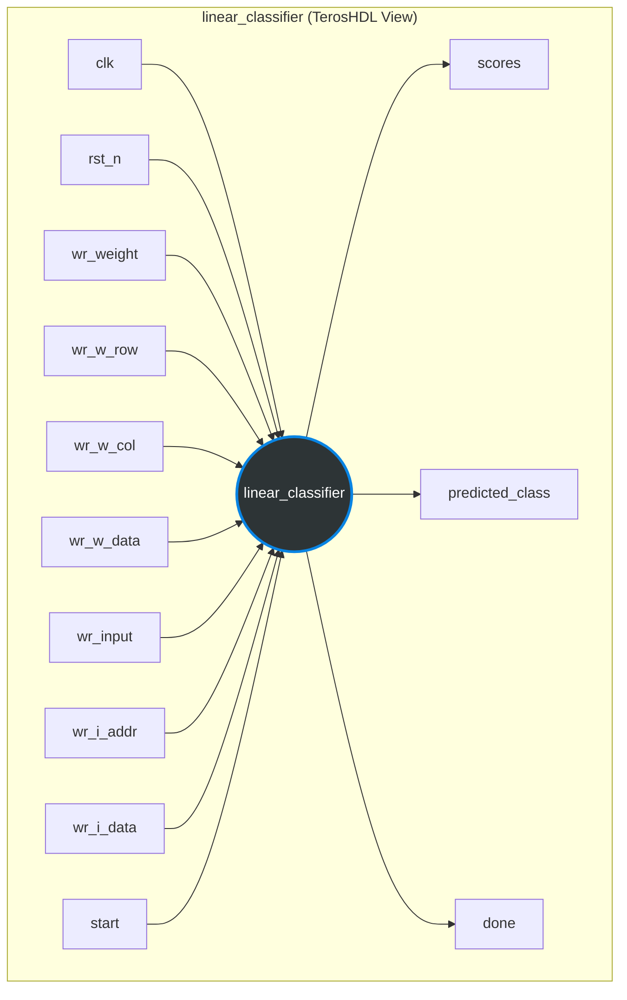
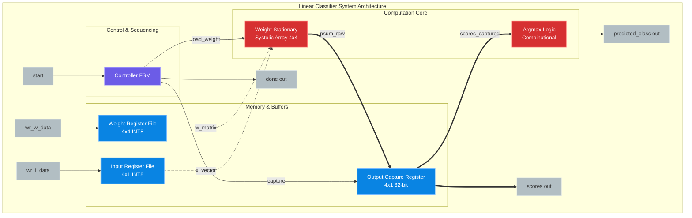
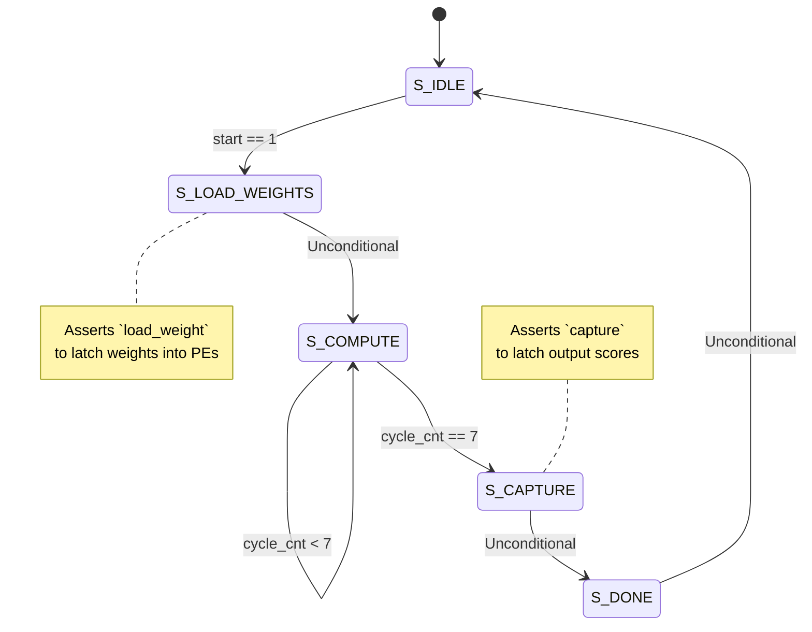

<!-- 
INSTRUCTIONS FOR CLAUDE:
Hello! The user will provide this Markdown file to you to generate a polished, professional Word document or PDF report. 
Please ensure the following when formatting the final document:
1. Apply a professional, academic, or corporate report template.
2. Render the Mermaid diagrams into high-quality images or vector graphics.
3. Ensure the tables are beautifully formatted with proper borders and header shading.
4. Maintain the structure and professional tone of the content. Feel free to refine the language slightly to make it flow perfectly for a formal report.
-->

# Project Report: Custom AI Accelerator for Edge Inference
## Linear Classifier Core for RISC-V Integration

---

## 1. Introduction: Inference on the Edge and AI Accelerators

In recent years, the paradigm of artificial intelligence has shifted from centralized, cloud-based processing to **Edge AI**—performing machine learning inference directly on localized devices such as IoT sensors, wearables, and embedded systems. 

**Motives behind Edge Inference:**
- **Latency:** Real-time applications (e.g., autonomous systems, industrial monitoring) cannot afford the round-trip delay of sending data to the cloud.
- **Bandwidth:** Transmitting high-bandwidth raw data (like audio or video) to the cloud is inefficient and costly.
- **Privacy and Security:** Processing sensitive data locally prevents potential exposure during transmission.
- **Power Efficiency:** Sending data wirelessly consumes significantly more power than local computation. 

To achieve efficient edge inference, general-purpose processors are often insufficient due to the highly parallel nature of neural network workloads (primarily Matrix-Vector and Matrix-Matrix multiplications). This is where **AI Accelerators** come into play. Dedicated hardware accelerators are designed to perform specific AI operations (like Multiply-Accumulate or MAC operations) with extreme energy efficiency and throughput compared to CPUs.

## 2. Integration Context: A Custom AI Accelerator for RISC-V

The **Linear Classifier Core** documented in this report is designed as a custom AI accelerator intended to be tightly coupled with a **RISC-V processor**. 

By memory-mapping the accelerator's register files or using custom RISC-V instructions (e.g., via the RoCC interface), the RISC-V core can offload intensive linear classification tasks (such as feature vector evaluation). The CPU simply streams the weight matrices and input features into the accelerator, triggers the `start` signal, and waits for the `done` interrupt. The accelerator computes the highly parallel dot-products using a weight-stationary systolic array and automatically determines the predicted class using its internal argmax logic, freeing the CPU to perform other tasks or enter a low-power state.

---

## 3. Module Documentation: `linear_classifier`

The following documentation and interface specifications have been generated in the style of TerosHDL.

### Description
The `linear_classifier` is the top-level module that computes `y = x · W` using a 4×4 weight-stationary systolic array. It captures output scores and determines the predicted class (argmax). It integrates weight registers, input registers, the systolic computation array, output capture registers, and a finite state machine (FSM) controller.

### Parameters

| Name | Value | Type | Description |
| :--- | :--- | :--- | :--- |
| `DW` | 8 | integer | Data width for inputs and weights (INT8 signed). |
| `AW` | 32 | integer | Accumulator width for the partial sums and final scores. |
| `N` | 4 | integer | Array dimension (4x4 matrix and 4-element vectors). |

### Ports

| Name | Direction | Width | Description |
| :--- | :--- | :--- | :--- |
| `clk` | input | 1 bit | System clock. |
| `rst_n` | input | 1 bit | Active-low asynchronous reset. |
| `wr_weight` | input | 1 bit | Write enable for the weight register file. |
| `wr_w_row` | input | 2 bits | Row address for writing into the weight matrix. |
| `wr_w_col` | input | 2 bits | Column address for writing into the weight matrix. |
| `wr_w_data` | input | `DW` bits | Signed weight data to be written into the targeted row/col. |
| `wr_input` | input | 1 bit | Write enable for the input feature register file. |
| `wr_i_addr` | input | 2 bits | Address indicating which element of the feature vector to write. |
| `wr_i_data` | input | `DW` bits | Signed feature data to be written. |
| `start` | input | 1 bit | Control pulse to begin the classification computation. |
| `scores` | output | `N` × `AW` bits | Array of `N` calculated scores (dot product results). |
| `predicted_class`| output | 2 bits | Index of the class with the maximum score (Argmax). |
| `done` | output | 1 bit | Flag indicating the classification is complete and outputs are valid. |

---

## 4. Block Diagrams

### 4.1 Interface Block Diagram

### 4.2 Internal Architecture Diagram

### 4.3 Controller State Machine (FSM)

